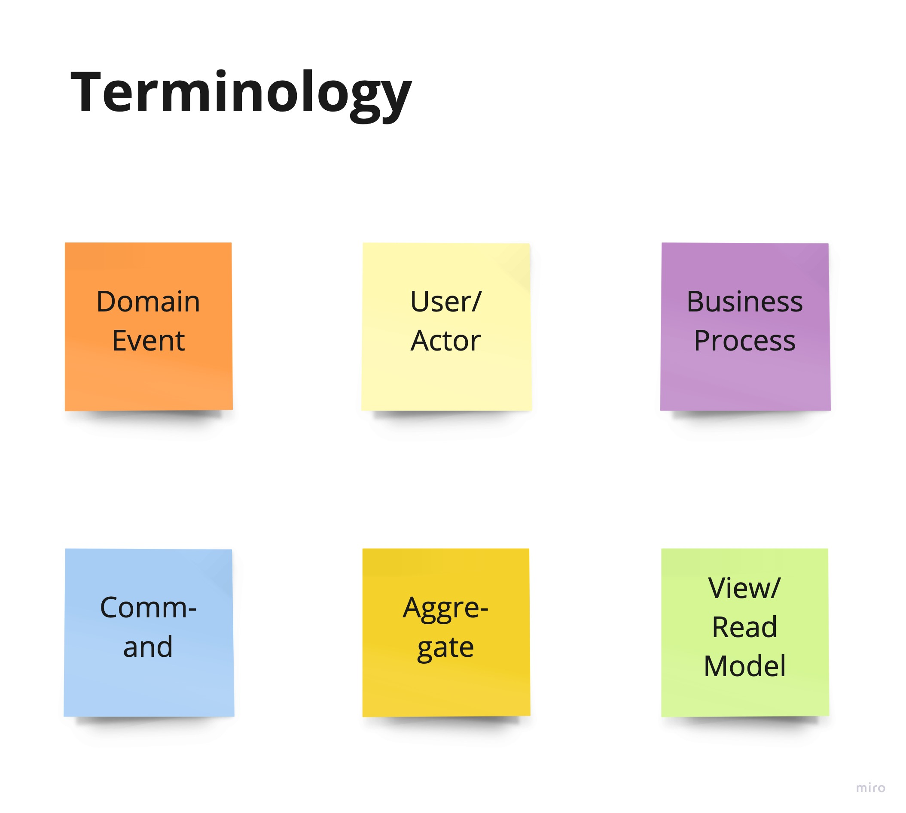
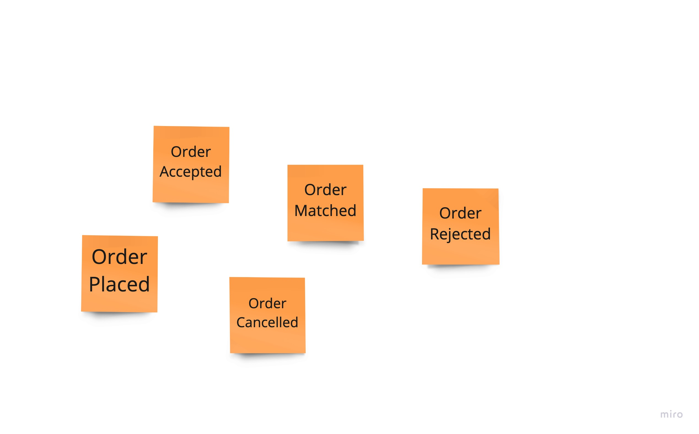
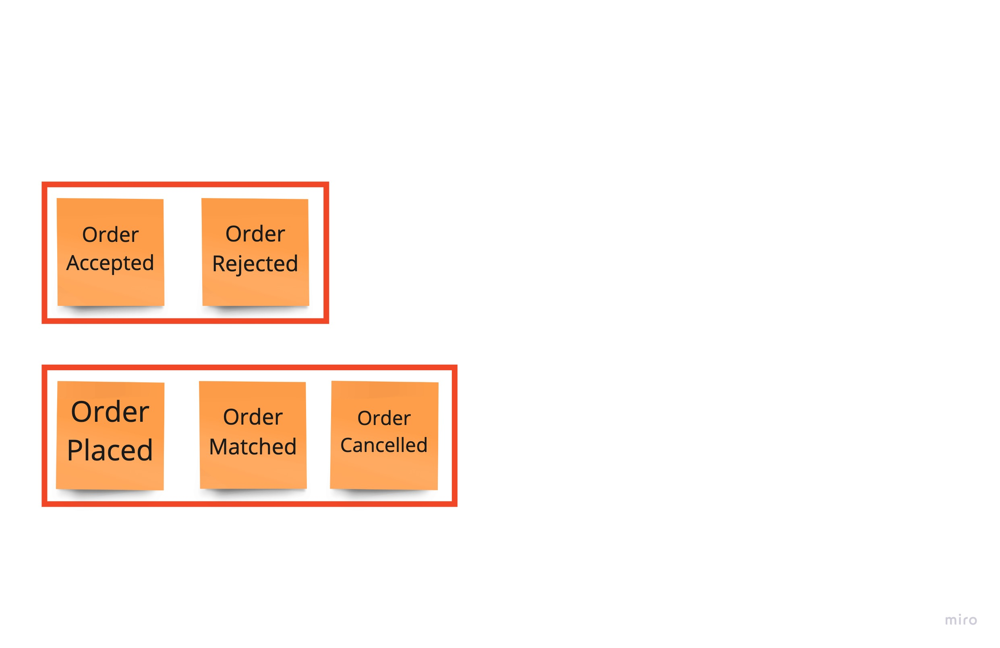
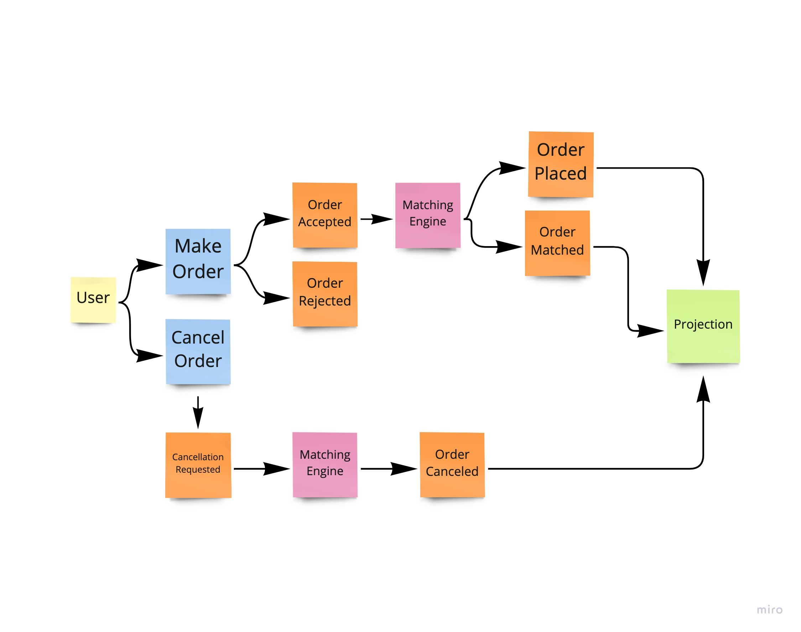
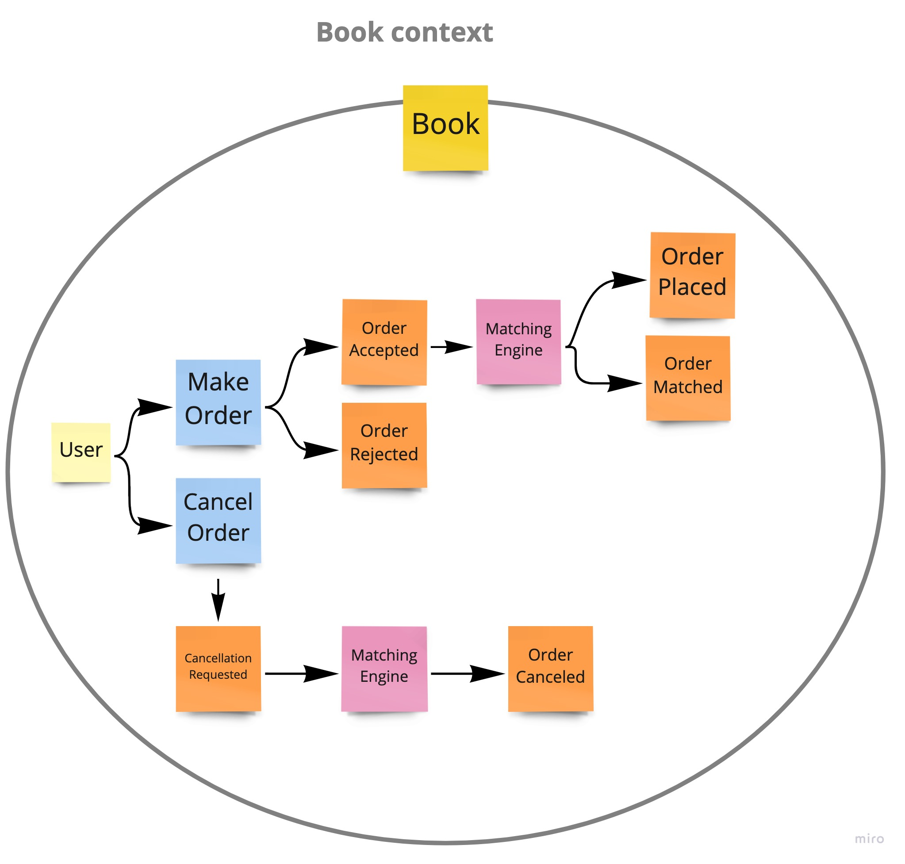

# Reactive Stock Market

### Introduction

This project takes you through the design of simple reactive stock market application.

#### Takeaways:
- Spring Boot application with matching engine as it core
- Light custom Reactive CQRS framework
- Matching engine implemented using Max-Heap and Min-Heap
- Application supports backpressure and event streaming

### Anatomy

- **Matching engine**
    + [Matching Engine](src/main/java/com/github/schananas/reactivestockmarket/domain/engine/MatchingEngine.java) uses Max-Heap and Min-Heap
    + Time complexity for critical operations are as:
        + Add – O(log N)
        + Cancel – O(1)
    + Buy tree - The collection of orders sorted in the ascending order, that is, higher buy prices have priority to be matched over lower.
    + Sell tree - The collection of orders in the descending order, that is, lower sell prices have priority to be matched over higher.
    + Each state transition is the consequence of an event. Events are played sequentially and therefore engine is single-threaded. Thread synchronisation is handled outside of engine.

- **Reactive**
    + Asynchronous, event driven, non-blocking programming perfectly fits for given problem. We want to subscribe to engine updates instead of blocking the threads.
    + Business logic can be broken down into a pipeline of steps where each of the steps can be executed asynchronously
    + Using Reactor most parallelism and concurrency in project is carefully handled.
    + Operations are optimised to execute in parallel when possible. For example orders of single asset are executed sequentially, but orders of different assets are executed in parallel.

- **DDD**
    + The goal of domain-driven design (DDD) is to establish a ubiquitous language and detailed understanding of the business needs and processes
    + This will allow the business domain experts -- those most familiar with the stock trading domain and the role our business has in it -- to communicate their domain knowledge with the rest of the team.
    + Event storming and DDD allow us to model our system in an asynchronous way, which is suitable for reactive, cloud-native systems analysis and design.
  
- **CQRS**
    + Greatly simplifies architecture, scalability and modularity
    + Model order requests as commands. Command handlers validates request and then either accepts or reject order request.
    + All state changes can be modeled as an event, and can be stored and replayed if needed. Lack of concurrency between events also ensures determinism and makes code much cleaner and more efficient to run.
    + This avoids need to store complicated states and structures in database, instead if needed in-memory state can be reconstructed based on past events.
    + Use projections to separate aggregate state and state used for querying. We are able to build highly optimised projections based on business needs. We can query them without need to peek into engine state, and avoid potential performance congestions.

- **Protobuf**
    + Describes API schema once, in proto format (see [api.proto](src/main/resources/api.proto))
    + Supports backward compatibility
    + The Protocol Buffers specification is implemented in many languages
    + Less Boilerplate Code - auto generated code, out-of-box JSON serializer...

### Event storming

some **This is Red Bold.** text

Order requests are modeled as commands
...
Aggregate is Book...
Matching engine is aggregate entity...
Two type of events, update and event sourcing events...
queries are going to projection instead to the state...

### Reactive vs Blocking

Thread-based architectures just don’t scale that well. There is a limit to how many threads can be created, fit into memory and managed at a time. The reactor pattern removes this problem by simply demultiplexing concurrent incoming requests and running them, on a (usually) single-application thread.

**Blocking**

Let's consider the case when two users are trying to access same component or resource.

To avoid concurrency issues every component needs to be synchronized in some way. Usually we use locks to assure only one user can access shared component at the time.
If component is already used by another user we need to wait for our turn by blocking on a lock. Implications are that every component on an execution path needs to be optimized for concurrent usage, which adds extra complexity and increases chances for concurrency issues, which are hard to find and cover with tests.
Second problem is scalability. N users would span N threads that are competing against each other to access component. Usually time of thread synchronisation and context switch is negligible, but as number of users (threads) grow, this time has more impact on our performance. 

**Reactive**

So how can we reduce complexity and improve performance for high load? In this project all user "intents" of user interaction with system are modeled as commands.

Using reactor pattern commands are de-multiplexed (see [CommandBus:80](src/main/java/com/github/schananas/reactivestockmarket/domain/bus/CommandBus.java)) to a single "flow" of execution. I'm using word flow instead of thread here, as threads can arbitrarily be changed in Project Reactor, but that does not matter as we model our flow in such way that we know which components can be only accessed sequentially and which concurrently.
Then we place our components within this flow. Each component executes one intent/command at the time, like any synchronized component from blocking example would. Once command is executed, next is taken from flow and gets executed. There is also option to specify what is maximum time allowed to access component, preventing potential congestion. 
Now components can be single threaded without any concurrency protection complexity.
Once all steps from flow have been executed, user is asynchronously notified with response.

**Reactive with parallel execution**

So what if some components can be accessed in parallel? In case of this project, if two users are bidding for two different assets/instruments we can execute their orders in parallel as assets are two logically separated components. (see [Book aggregate](src/main/java/com/github/schananas/reactivestockmarket/domain/Book.java))
In this case we just multiplex flow again and split it to two separate flows, each executing commands and orders for distinct assets. (see [CommandBus:51](src/main/java/com/github/schananas/reactivestockmarket/domain/bus/CommandBus.java))

**Real example**

Given this, this is what we would like to a achive.

First step to de-multiplex user commands is not necessary as we multiplex right after.
But it's done to preserve order of commands and to put all commands into project reactor context in order deal easier with further parallelism and concurrency.
We multiplex pipeline for each aggregate id (instrument id).
Now as we have parallel pipelines for distinct instruments, we remove most of the synchronisation from our components like Matching Engine.
Question arises, why are aggregate and query repository represented as non-shared components, when they are singletons which all pipelines can access concurrently?
Both components use ConcurrentHashMap (todo change implemenation) which in contract to SyrnoziedMap is not locking whole map on update. Instead ConcurrentHashMap is devided into segments and each segment maintains its own lock. Any thread that wants to enter into segment have to acquire that segments lock.
Number of segments is decided by the parameter called concurrency levl which is passed while instantiating ConcurrentHashMap.As we multiplexed our pipelines per instrument id, we know that each pipleline will access map segments sequentialy, therefore whole pipleline remains lockless.

**How to scale?** 

Vertical horizontal...

long vs bigdecimal and pitfalls

### Optimisation and improvements

- Embrace eventual consistency
- Don't block while waiting for response
- REST should not return projection
- UI is also a different type of projection - build it using events!
- Synchronous systems rely on request/response semantics; as in, we invoke a method or RESTful endpoint and expect a response.
- The caller blocks until receiving a response. If the response is delayed or fails, this can lead to resource starvation due to accumulating timeouts. At the very minimum, any delay when integrating with third-party systems can cause noticeable latency in our services.
- 
### Tests

- [x] Unit tests
- [x] Integration tests
- [x] Load test

### How to run

Execute `mvn clean install` to build project and generate protobuf classes.

Then execute `mvn spring-boot:run` to run application, or use IDE of choice to run application as Spring Boot application.

### Trivia

Originally assigment is given to Senior Software Engineers as a technical coding interview in some stock/crypto market companies.

Read [system requirements here.](system_requirements.pdf)